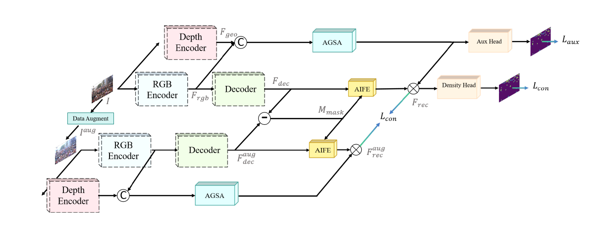

# DCCNet: Decoupling Geometry and Appearance for Cross-Domain Crowd Counting

**ICME 2026 Spotlight**
[Project page](https://jason-mar1.github.io/DCCNet/) | [Citation](#citation) | [Code](https://github.com/Jason-Mar1/DCCNet)

DCCNet is a domain-generalization method for crowd counting. It treats cross-domain shift as two coupled factors: geometric projection and visual appearance. The model uses a depth prior to anchor geometry, aligns RGB and geometric features with AGSA, and learns an appearance-invariant feature dictionary with AIFE.

> **Release scope.** This is a code-focused release. It does **not** include crowd-counting datasets, processed annotations, or trained DCCNet checkpoints. The commands below document the released launch interface, but full training and reproduction of the paper tables have **not** been completed in this checkout. Reported numbers are transcribed from the paper; they are not results rerun for this release.

<p align="center">
  
</p>

## Paper at a glance

Cross-domain crowd counting degrades under changes in camera perspective, scale, illumination, and scene appearance. DCCNet introduces:

- **Geometry-aware alignment:** a frozen Depth Anything prior supplies structural cues, and **AGSA** adaptively refines the fused representation with learnable channel selection and deformable spatial attention.
- **Appearance-invariant reconstruction:** **AIFE** uses a learned prototype dictionary and a consistency constraint between two augmented views to suppress style-specific features.
- **Auxiliary foreground supervision:** an auxiliary head predicts a foreground map during training, helping the network distinguish crowd regions from background clutter. At inference, the second augmented view and consistency-only path are omitted, while the learned geometry-guided foreground gate remains internal to density prediction.

The paper trains on one source domain and evaluates directly on an unseen target domain, with no target-domain fine-tuning. Its reported setup uses a VGG-16 backbone, a frozen depth-prior network, 200 epochs, Adam with an initial learning rate of 1e-4, batch size 8, and one RTX 4090. These are paper settings, not a claim that the exact run has been reproduced by this release.

## Paper-to-code map

| Paper component | Release implementation | Role |
| --- | --- | --- |
| **DCCNet** | `models/models.py` (`DCCNet`; `GPD` and `DGModel_final` are compatibility aliases) | End-to-end crowd-counting network: a `torchvision` `vgg16_bn` feature extractor, multi-scale decoder, geometry fusion, dictionary reconstruction, density prediction, and foreground gate. |
| **AGSA** | `utils/attention_module.py` and the geometry-fusion block in `models/models.py` | Learnable channel pooling plus deformable spatial attention used to calibrate geometry-aware features. |
| **AIFE** | `AIFE` (`MemoryModule` compatibility alias) in `models/models.py` | Learned prototype/dictionary reconstruction of density features. |
| **Dual-view training** | `DenClsDataset` / `JHUDomainClsDataset`, `DCCNet.forward_train`, and `DGTrainer.train_step` | Generates an appearance-augmented second view and applies the reconstruction-consistency objective during training. |
| **Auxiliary head** | `cls_head` in `models/models.py`; binary maps from `DenClsDataset` / `JHUDomainClsDataset` | Foreground-map BCE supervision during training; its learned output remains an internal density gate at inference. |

The names `GPD` and `DGModel_final` are retained from the research code for compatibility; the paper method is DCCNet.

## Installation

```bash
git clone https://github.com/Jason-Mar1/DCCNet.git
cd DCCNet

conda create -n dccnet python=3.10 -y
conda activate dccnet
pip install -r requirements.txt
```

DCCNet obtains only the DINOv2 **architecture source** through `torch.hub` at pinned commit [`7764ea0f912e53c92e82eb78a2a1631e92725fc8`](https://github.com/facebookresearch/dinov2/tree/7764ea0f912e53c92e82eb78a2a1631e92725fc8); the first use may need network access to cache that source. It does not download DINOv2 pretrained weights. A fresh training run may also download the `torchvision` VGG16-BN ImageNet initialization; test, visualization, and single-image inference skip that redundant download because their DCCNet checkpoints replace the backbone. On an actual training, evaluation, or inference run, the loader downloads `pytorch_model.bin` from `LiheYoung/depth_anything_vits14` at pinned Hugging Face revision [`1bee667edbfec7f9b345abaffec8c9c2bd5293c2`](https://huggingface.co/LiheYoung/depth_anything_vits14/tree/1bee667edbfec7f9b345abaffec8c9c2bd5293c2) unless `depth_anything.depth_checkpoint` or `--depth-checkpoint` points to a local file. No such asset has been downloaded or end-to-end validated in this checkout. See [THIRD_PARTY.md](THIRD_PARTY.md) for attribution and terms.

## Data preparation

The repository deliberately contains no benchmark data. Download each dataset from its official provider and prepare it locally. The configurations use these identifiers:

| Paper abbreviation | Dataset | Configuration root |
| --- | --- | --- |
| **A / STA** | ShanghaiTech Part A | `data/shanghaitech/part_a` |
| **B / STB** | ShanghaiTech Part B | `data/shanghaitech/part_b` |
| **Q / QNRF** | UCF-QNRF | `data/ucf_qnrf` |
| **JHU** | JHU-CROWD++ | `data/jhu_crowdpp` |

For the expected processed layout, paired annotation files, density maps, and JHU domain manifests, see [docs/data_layout.md](docs/data_layout.md). Dataset terms and redistribution restrictions remain those of the respective providers.

## Training

Run from the repository root after preparing the source-domain data. Each YAML names one directed paper protocol, defines its source and target datasets, and writes its checkpoint under the matching `logs/<protocol>/` directory. Add `--depth-checkpoint /path/to/pytorch_model.bin` to any command to use a local pinned Depth Anything file instead of downloading it.

```bash
# ShanghaiTech / UCF-QNRF protocols
python main.py --config configs/shanghaitech_a_to_b.yaml --task train
python main.py --config configs/shanghaitech_a_to_qnrf.yaml --task train
python main.py --config configs/shanghaitech_b_to_a.yaml --task train
python main.py --config configs/shanghaitech_b_to_qnrf.yaml --task train
python main.py --config configs/shanghaitech_qnrf_to_a.yaml --task train
python main.py --config configs/shanghaitech_qnrf_to_b.yaml --task train

# JHU-CROWD++ protocols
python main.py --config configs/jhu_str_to_sta.yaml --task train
python main.py --config configs/jhu_sta_to_str.yaml --task train
```

Training writes `logs/<protocol>/last.pth` and the validation-best `logs/<protocol>/best.pth`. The configurations point evaluation at the latter by default. No checkpoint is bundled with this release.

## Cross-domain evaluation

The following commands cover the six ShanghaiTech/UCF-QNRF transfer directions and the two JHU-CROWD++ directions reported in the paper. They require locally prepared target data and a compatible checkpoint. `--checkpoint` is optional because the selected YAML already names its default `logs/<protocol>/best.pth`; it is shown here to make the expected checkpoint explicit.

```bash
# A -> B, A -> Q
python main.py --config configs/shanghaitech_a_to_b.yaml --task test --checkpoint logs/shanghaitech_a_to_b/best.pth
python main.py --config configs/shanghaitech_a_to_qnrf.yaml --task test --checkpoint logs/shanghaitech_a_to_qnrf/best.pth

# B -> A, B -> Q
python main.py --config configs/shanghaitech_b_to_a.yaml --task test --checkpoint logs/shanghaitech_b_to_a/best.pth
python main.py --config configs/shanghaitech_b_to_qnrf.yaml --task test --checkpoint logs/shanghaitech_b_to_qnrf/best.pth

# Q -> A, Q -> B
python main.py --config configs/shanghaitech_qnrf_to_a.yaml --task test --checkpoint logs/shanghaitech_qnrf_to_a/best.pth
python main.py --config configs/shanghaitech_qnrf_to_b.yaml --task test --checkpoint logs/shanghaitech_qnrf_to_b/best.pth

# JHU-CROWD++ Street -> Stadium and Stadium -> Street
python main.py --config configs/jhu_str_to_sta.yaml --task test --checkpoint logs/jhu_str_to_sta/best.pth
python main.py --config configs/jhu_sta_to_str.yaml --task test --checkpoint logs/jhu_sta_to_str/best.pth
```

`A`, `B`, and `Q` mean ShanghaiTech Part A, ShanghaiTech Part B, and UCF-QNRF respectively. `str` and `sta` are the release configuration names for JHU Street and Stadium.

## Single-image inference

Supply a compatible DCCNet checkpoint yourself, then run:

```bash
python inference.py \
  --img-path path/to/image.jpg \
  --model-path logs/shanghaitech_a_to_b/best.pth \
  --config configs/shanghaitech_a_to_b.yaml \
  --vis-dir outputs/inference
```

`--img-path` also accepts a directory of `.jpg`, `.jpeg`, or `.png` files. `--save-path predictions.txt` records counts, and `--patch-size` can be reduced if a large image exhausts GPU memory. The selected `--config` must match the checkpoint architecture; add `--depth-checkpoint /path/to/pytorch_model.bin` for an offline local depth-prior file.

## Reported main results

The table below reproduces the paper's reported direct-transfer results. Lower is better. It is included as a reference to the paper, not as a fresh verification of this release.

| Source -> target | MAE | MSE |
| --- | ---: | ---: |
| A -> B | 9.6 | 17.0 |
| A -> Q | 108.5 | 184.5 |
| B -> A | 89.0 | 159.5 |
| B -> Q | 162.3 | 290.9 |
| Q -> A | 66.3 | 113.1 |
| Q -> B | 10.8 | 18.5 |

| JHU-CROWD++ source -> target | MAE | MSE |
| --- | ---: | ---: |
| Street -> Stadium | 29.8 | 63.4 |
| Stadium -> Street | 205.3 | 675.8 |

## Citation

If you use DCCNet, please cite:

```bibtex
@inproceedings{ma2026dccnet,
  title     = {Decoupling Geometry and Appearance for Cross-Domain Crowd Counting},
  author    = {Ma, Hao-Yuan and Zhang, Li and Qiu, Yushi and Gao, Jie},
  booktitle = {Proceedings of the IEEE International Conference on Multimedia and Expo (ICME)},
  year      = {2026}
}
```

Machine-readable citation metadata is available in [CITATION.cff](CITATION.cff).

## License and acknowledgements

The DCCNet code is released under the [Apache License 2.0](LICENSE). Third-party sources, model weights, and datasets may have additional terms; see [THIRD_PARTY.md](THIRD_PARTY.md) and the upstream providers before use or redistribution.

This work builds on [Depth Anything](https://github.com/LiheYoung/Depth-Anything), [DINOv2](https://github.com/facebookresearch/dinov2), PyTorch, and the ShanghaiTech, UCF-QNRF, and JHU-CROWD++ benchmark communities.
